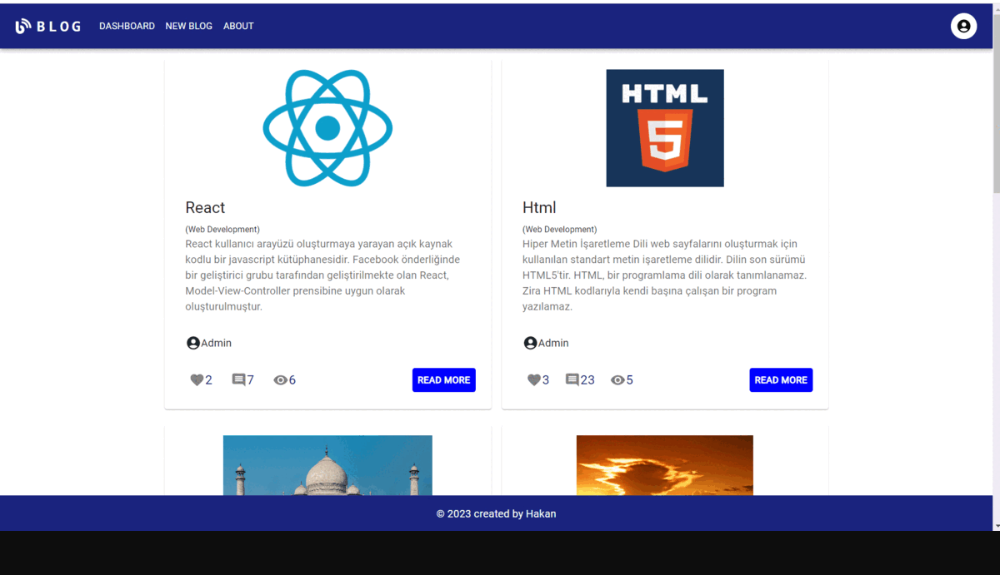

# Blog App Project

## `Installation`

```
yarn create react-app (folderName OR .)
```

## `Libraries Used`

- `@reduxjs/toolkit`
- `react-redux`
- `axios`
- `react-router-dom`
- `@mui/material-ui`
- `@mui/icons-material`
- `@mui/x-data-grid`
- `@emotion/react`
- `@emotion/styled`
- `react-router-dom`
- `react-toastify`
- `redux-persist`
- `react-icons`
- `react-helmet`
- `tailwindcss`
- `formik`
- `yup`

## `What am I doing`

- In this project, I am making a blog application.
- Blog pages are an ideal platform to share personal thoughts, knowledge and expertise with others. You can interact with your readers by creating content about topics that interest you.
- In this application, the user can write, update and even delete their own blog posts.
- Crud operations are performed according to the swagger and redoc documents from the backend.

## Project Skeleton

```

├── public
│     └── index.html
├── src
│    ├── app
│    │     └── store.jsx
│    ├── assets
│    │     └── myAvatar.png
│    ├── components
│    │     ├── auth
│    |     │     ├── LoginForm.jsx
│    |     │     └── RegisterForm.jsx
│    │     ├── blog
│    |     │     ├── BlogCard.jsx
│    |     │     ├── CommentCard.jsx
│    |     │     └── NewBlogForm.jsx
│    │     ├── modals
│    |     │     ├── BlogModal.jsx
│    |     │     ├── CategoryModal.jsx
│    |     │     └── CategoryUpdateModal.jsx
│    |     ├── Footer.jsx
│    │     └── Navbar.jsx
│    ├── features
│    |     ├── authSlice.jsx
│    │     └── blogSlice.jsx
│    ├── helpers
│    │     └── ToastNotify.js
│    ├── hooks
│    |     ├── useAuthCall.jsx
│    |     ├── useAxios.jsx
│    │     └── useBlogCall.jsx
│    ├── pages
│    │     ├── About.jsx
│    │     ├── Categories.jsx
│    │     ├── Dashboard.jsx
│    │     ├── Details.jsx
│    │     ├── Login.jsx
│    │     ├── MyBlog.jsx
│    │     ├── NewBlog.jsx
│    │     ├── NotFound.jsx
│    │     ├── Profile.jsx
│    │     └── Register.jsx
│    ├── router
│    │     ├── AppRouter.jsx
│    │     └── PrivateRouter.jsx
│    ├── styles
│    │     └── globalStyle.jsx
│    ├── App.js
│    ├── index.js
│    └── index.css
├── package.json
├── .gitignore
└── yarn.lock
```

## `Tools Used`

- `Redux Dev Tools` : It is a browser extension that runs on Chrome and enables tracking of all changes made to the global state. For download [click here.](https://chrome.google.com/webstore/detail/redux-devtools/lmhkpmbekcpmknklioeibfkpmmfibljd?utm_source=chrome-ntp-icon)`

## `Gif`



## `Live`

- https://main--myblogpagereact.netlify.app/
